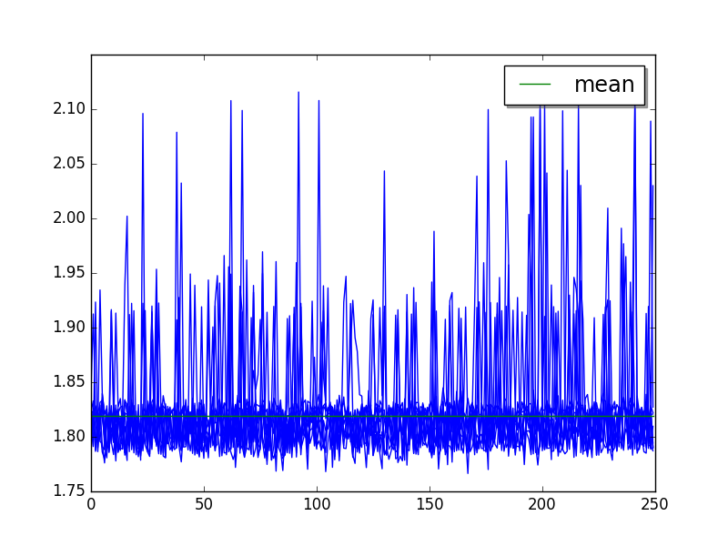
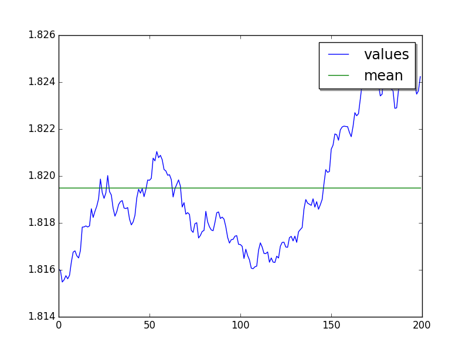

.. _pypy_warmups:

++++++++++++++++++++++++++++++++++++++++++++++++
Analyze of PyPy warmup in performance benchmarks
++++++++++++++++++++++++++++++++++++++++++++++++

See also :ref:`Python performance <python-perf>`.

.. contents::
   :depth: 2

Goal
====

The purpose of this analysis if to choose the number of warmups and samples for
`performance benchmarks <http://pyperformance.readthedocs.io/>`_ for PyPy 5.7
on the speed-python server.

* small enough to reduce total runtime
* get a mean-stdev of the sample close enough to mean-stdev of all values
* if performance has a cycle (usually with a spike at the start or end):
  compute 5 cycles to use the average of a cycle

General notes
=============

The analysis is based on a single data set: `pypy2_571_warmups.json.gz
<https://github.com/haypo/performance_results/raw/master/2017-04-13-pypy/pypy2_571_warmups.json.gz>`_.

* PyPy2 5.7.1 (revision 1aa2d8e03cdf): 64-bit, static binary
* perf 1.2 (dev), performance 0.5.5 (dev)
* performance hacked to run exactly 10 worker processes, each computes 250
  values with 0 warmup
* Date: 2017-04-13 22:19 - 2017-04-14 09:01 (10h45)
* 67 benchmarks

After computing these data, the following 4 microbenchmarks have been removed
from performance benchmark suite and so will be ignored here.

* call_method
* call_method_slots
* call_method_unknown
* call_simple

speed-python server:

* cpu: 2 HP DL380 G7 Intel® Xeon® X5680 (3.33GHz/6-core/130W/12MB) FIO Processor Kit
* memory: 4x 4GB (1x4GB) Dual Rank x4 PC3-10600 (DDR3-1333) Registered CAS-9 Memory Kit
* OS: Ubuntu 16.04.1 LTS
* Kernel: GNU/Linux 4.4.0-47-generic

Script used to get the number of loops computed by perf::

    import perf
    suite = perf.BenchmarkSuite.load('pypy.json.gz')
    for bench in suite:
        loops = [run._get_loops() for run in bench.get_runs() if run.values]
        if len(set(loops)) != 1:
            raise Exception(bench)
        loops = loops[0]
        print("%s: loops=%s" % (bench.get_name(), loops))

2to3: loops=1, warmups=0, samples=30
====================================

* many spikes up to +16% of the mean
* no cycle
* moving average(50) increases from 1.816 sec to 1.824 sec

Overall:

Moving average (50 values) of runs:

chameleon: loops=32, warmups=6, samples=10
==========================================

* cycle of 2 values (^v^v^v...)
* loops=32, warmups=6, samples=10: 7.05 ms +- 0.23 ms

* larger cycle of 42 values (/^^\_/^^\_/^^\_...)
* loops=32, warmups=6, samples=42: 7.02 ms +- 0.20 ms

* LIMIT: loops=32, warmups=6: 7.01 ms +- 0.20 ms

chaos: loops=16, warmups=20, samples=25
=======================================

    cycle of 5 values (___^^)
    loops=16, warmups=20, samples=25: 6.50 ms +- 0.22 ms

    glitch at value 35..38
    loops=16, warmups=40, samples=25: 6.48 ms +- 0.21 ms

    LIMIT: warmups=40: 6.48 ms +- 0.21 ms

crypto_pyaes: loops=16, warmups=46, samples=45
==============================================

    cycle of 9 values (/\/\/\...)
    --run-means=1
    loops=16, warmups=46, samples=45: 9.80 ms +- 0.25 ms
    LIMIT: loops=16, warmups=46: 9.81 ms +- 0.24 ms

deltablue: loops=256, warmups=14, values=55
===========================================

    cycle of 11 values
    loops=256, warmups=14, values=55: 441 us +- 20 us
    LIMIT: loops=256, warmups=14: 440 us +- 19 us

django_template: loops=4, warmups=12, samples=36
================================================

    cycle of 7 ... or 8 ... values (avg: 7.3)

    loops=4, warmups=12, samples=36: 36.9 ms +- 1.6 ms
    loops=4, warmups=12, samples=73: 36.9 ms +- 1.6 ms
    LIMIT: loops=4, warmups=12: 36.9 ms +- 1.6 ms

dulwich_log: loops=2, warmups=21, values=18
===========================================

    cycle of 3.6 (avg) values
    loops=2, warmups=21, values=18: 98.6 ms +- 4.7 ms
    LIMIT: loops=2, warmups=21: 96.8 ms +- 4.4 ms

fannkuch: loops=1, warmups=59, values=40
========================================

    long cycle of 40 values: 40, 80, 120, ...
    loops=1, warmups=59, values=40: 171 ms +- 1 ms
    LIMIT: loops=1, warmups=59: 171 ms +- 1 ms

float: loops=4, warmups=25, samples=40
======================================

    loops=4, warmups=25, samples=40: 41.0 ms +- 0.4 ms (step1)
    loops=4, warmups=117: 39.9 ms +- 1.7 ms (step 2)

    two steps:
    - values 25..40, around 41 ms
    - (slow speedup on values 41..116)
    - values after 117: around 40 ms, with a cycle of ~14 values

genshi_text: loops=8
====================

    BUG! 19 ms at value 0 => 92 ms at value 250, steady slowdown!

genshi_xml: loops=2
===================

    BUG! 70 ms at value 0 => 200 ms at value 250, steady slowdown!

go: loops=2, warmups=87, samples=80
===================================

    slow but contiguous optimization!
    88.3 ms
    1 run at 75 ms, 9 runs around 87 ms
    after 87 warmups, cycle of 16 values
    80 values = 5 cycles

    loops=2, warmups=87, samples=32: 87.4 ms +- 4.9 ms
    loops=2, warmups=87, samples=80: 87.3 ms +- 5.0 ms
    LIMIT: loops=2, warmups=87: 87.2 ms +- 5.0 ms

hexiom: loops=64, warmups=36, samples=50
========================================

    cycle of 25 values
    loops=64, warmups=36, samples=50: 2.32 ms +- 0.04 ms
    LIMIT: loops=64, warmups=36: 2.33 ms +- 0.05 ms

hg_startup: loops=1, warmups=4, samples=10
==========================================

    loops=1, warmups=4, samples=10: 243 ms +- 1 ms
    LIMIT: loops=1, warmups=4: 243 ms +- 1 ms
    Each run has different speed, so use more runs

TODO
====

* html5lib: loops=2, warmups=50
* json_dumps: loops=16
* json_loads: loops=256
* logging_format: loops=2048
* logging_silent: loops=134217728
* logging_simple: loops=4096
* mako: loops=8
* meteor_contest: loops=2
* nbody: loops=4
* nqueens: loops=4
* pathlib: loops=8
* pickle: loops=64
* pickle_dict: loops=64
* pickle_list: loops=256
* pickle_pure_python: loops=128
* pidigits: loops=1
* pyflate: loops=1
* python_startup: loops=8
* python_startup_no_site: loops=8
* raytrace: loops=8
* regex_compile: loops=2
* regex_dna: loops=1
* regex_effbot: loops=4
* regex_v8: loops=1
* richards: loops=64
* scimark_fft: loops=16
* scimark_lu: loops=64
* scimark_monte_carlo: loops=32
* scimark_sor: loops=128
* scimark_sparse_mat_mult: loops=1024
* spambayes: loops=4
* spectral_norm: loops=16
* sqlalchemy_declarative: loops=1
* sqlalchemy_imperative: loops=8
* sqlite_synth: loops=32768
* sympy_expand: loops=1
* sympy_integrate: loops=4
* sympy_sum: loops=2
* sympy_str: loops=1
* telco: loops=8
* tornado_http: loops=2
* unpack_sequence: loops=2048
* unpickle: loops=128
* unpickle_list: loops=1024
* unpickle_pure_python: loops=128
* xml_etree_parse: loops=1
* xml_etree_iterparse: loops=1
* xml_etree_generate: loops=2
* xml_etree_process: loops=2
